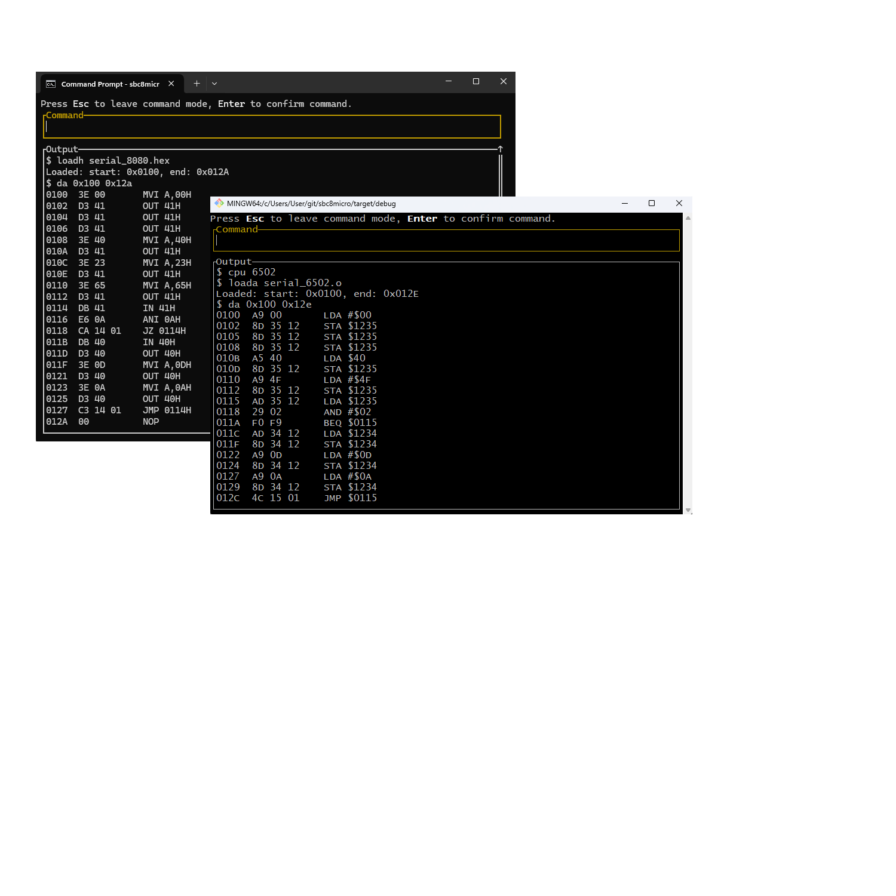
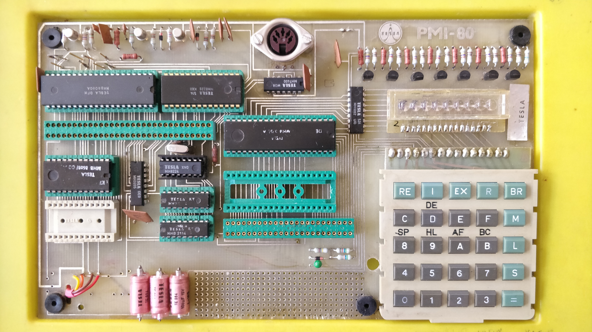
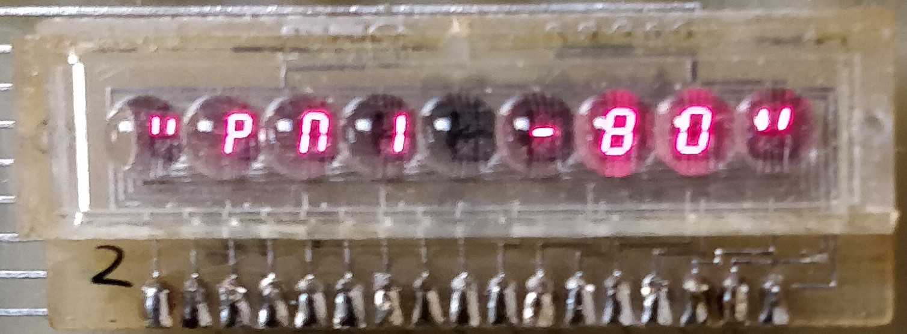

# sbc8micro - 6502, 8080 emulator.

This project is a result of my enthusiasm for retro computing. It was primarily triggered when my brother gave me a single-board 8080-based microcomputer, the **PMI-80**, from 1982. At that time, it was quite a legendary board in Czechoslovakia, though it was very simple.

It has a missing 8224 clock generator, so I had to spend some time finding a new one. All the chips on that board used to be produced in Czechoslovakia, and I wanted to find the original MHB8224 produced by a company named TESLA. (It has nothing to do with Elon's Tesla; he just stole the name 😆). But my effort paid off, and the board is now fully functional:

 

And then a question came out: "**Now what?**" 😏

As it was quite inconvenient to type hexadecimal code via keyboard, I decided that the cure for this would be an EPROM emulator. The problem was that those currently available don't support the old 1kB 8708 type of ROM used on this board. But there exists the emulator [EPROM-EMU-NG: EPROM Emulator Project with Arduino](https://github.com/Kris-Sekula/EPROM-EMU-NG), so I modified the software and adapted the probe so it can be used also for 1kB 8708 ROMs. My modification can be seen here: [EPROM_EMU_NG_FW_2708](https://github.com/sladek/EPROM_EMU_NG_FW_2708). And my enthusiasm didn't end there, and I also decided to design my own single-board microcomputer based on the Intel 8080 CPU. The design of [SBC_8080_ECB](https://github.com/sladek/SBC_8080_ECB) has already been finished and will be used for other projects based on the ECB bus. 

While working on the above-mentioned projects, I got an idea to write an emulator for the Intel 8080 CPU so I can verify the software from the convenience of my laptop. I also wanted to improve my skills related to the Rust programming language, so this looked like a good idea. I also asked ChatGPT about how to start a project like this one, but the response I got was only related to the MOS6502 CPU. So I accepted the challenge and decided to include both 8080 and 6502 CPUs 😃. The result is a modular system that can be tailored to specific requirements, and it also contains a graphical user interface so it can be used for debugging of the software, switching between CPUs, setting breakpoints, disassembling the code, viewing opcodes for specific CPUs, and much more. There is also a built-in emulator of the Intel 8251A serial interface, which can be mapped either to the IO address space (used by 8080) or the CPU's memory (used by 6502). This configuration allows you to connect to a running "system" from a terminal like PuTTY on Windows or Screen or Minicom on Linux. Other devices can easily be added, as the interface between device registers and the CPU is simple and well defined, so the implementation should be straightforward.
